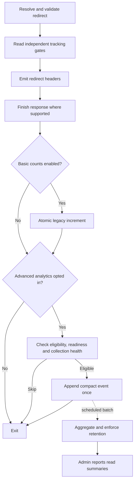

# GT Link Manager v1.9.0: opt-in advanced click analytics

Date: September 13, 2026. Status: proposed implementation plan; no runtime changes made.

Add useful click trends and breakdowns without adding anything to a visitor's page. Preserve existing `total_clicks` as an independent, optional running total. Advanced analytics begins only after the site owner explicitly enables it and storage setup succeeds.

The [v1.8.1 audit](../audits/2026-09-13-v1.8.1-audit.md) supplies the baseline and prerequisites. Performance numbers below are acceptance targets to test, not measured promises.

## 1. The opt-in contract

“No footprint before opt-in” means no advanced-analytics tables, options, schema markers, events, cron entries, queues, files, transients, identifiers, collection hooks, or analytics-specific queries. Installing the plugin necessarily places its shipped PHP files on disk; a small in-memory off check and a static admin explanation are the only analytics-related behavior before enablement. Existing link/category tables and basic counts remain part of the existing plugin.

Use a separate `enable_advanced_analytics` gate. Missing means off. Do not persist an analytics defaults bundle on activation, upgrade, ordinary settings saves, diagnostics, or opening the Analytics page. Do not add analytics columns to the links table. Existing `enable_click_tracking=1` never implies analytics consent.

| Basic counts | Advanced analytics | Result |
| --- | --- | --- |
| Off | Off | Existing redirects; no count or analytics writes. |
| On | Off | Existing atomic total only; no analytics storage or runtime. |
| Off | On | Eligible analytics events; `total_clicks` unchanged. |
| On | On | One legacy increment plus one eligible analytics event. |

Only a deliberate POST action with `manage_options` and nonce/authentication may enable collection. Present unchecked controls, the data fields, retention, and performance behavior before the action. Filters may suppress collection; a generic `gtlm_settings` filter alone must not create consent or initialize analytics. This plan interprets opt-in as the site owner's choice. A documented server-side eligibility filter must also allow a site's visitor-consent integration to deny collection before parsing or storage; owner opt-in is not a claim that visitor consent is unnecessary.

Enablement sequence:

1. Verify the submitted action and current state; serialize competing enable/delete operations with an admin-side lock.
2. Create only the analytics schema, verify InnoDB support and required indexes, and save a separate analytics schema version. DDL is not assumed transactional: a partial failure stays off, is reported, and can be retried or cleaned up explicitly.
3. Store the selected configuration with autoload disabled and register one recurring maintenance job. Verify scheduling succeeded and initialize collection health.
4. Commit the enabled flag and a new collection generation last. Read stored state back. Start collecting from this point, with no backfill from legacy totals.

The common plugin activator/upgrader must not create this schema. Upgrades of an already opted-in site may maintain its schema through admin/CLI lifecycle code; a frontend request never creates or repairs tables. If readiness/version checks fail, skip analytics and keep redirecting.

## 2. What v1.9.0 reports

- Click trends by hour/day, selectable dates, previous-period comparison, and top links.
- Per-link detail and category filters, referring host, country when available, and coarse device/browser/OS families.
- Configured campaign attribution using allowlisted `utm_source`, `utm_medium`, and `utm_campaign` values. Store a configured campaign ID, not arbitrary query values. Unknown values go to an unattributed bucket.
- Report CSV export, collection start/pause periods, data freshness, retention settings, and maintenance health.
- An optional per-link exclusion managed in analytics configuration, without adding a column to every link.

Reports count observed, eligible redirect requests. They do not measure destination page loads, sales, or unique people. No user/session identifier means no “unique visitor” metric. Do not invent CTR without impression data. Legacy lifetime totals and filtered period totals are labeled separately and can legitimately differ because of filters, start date, retention, failures, or pauses. Resetting basic counts does not reset analytics; deleting analytics does not reset basic counts.

Retain the v1.8.1 legacy eligibility/filter contract. For advanced analytics, accept a successful redirect from GET only; exclude HEAD/POST/OPTIONS, explicit prefetch/prerender indicators, recognized crawlers, and authenticated users with link-management capability by default. Bot recognition is a bounded heuristic, not proof that all remaining traffic is human. Do not log excluded requests. Provide a suppression hook and disclose the policy/version with reports.

Missing links, inactive/trashed links, geo blocks, invalid destinations, REST operations, and ordinary page views are not click events. Standard, direct, regex, and geo redirects use the same collector. Capture final status and stable link ID after routing/filters; do not attribute using raw paths or cached click counts.

## 3. Minimize the stored record

| Field | Treatment |
| --- | --- |
| Link | Stable numeric ID; never raw requested URL or slug as the attribution key. |
| Time | UTC timestamp for short-lived events; UTC hourly bucket in summaries. |
| Source | Lowercase validated referring hostname, at most 253 ASCII bytes; strip credentials, path, query, fragment, and port; reject IP literals/malformed values. Blank means “Direct / unknown.” |
| Country | Valid two-letter code from an explicitly configured trusted proxy/header source; otherwise unknown. No IP lookup, DNS, GeoIP file download, or external request. |
| Client | Enumerated device, browser family, and OS family derived from a capped user-agent input; never store the original header or detailed versions. |
| Campaign | Numeric ID for a preconfigured allowlisted campaign combination; otherwise unattributed. No `gclid`, `fbclid`, free-form UTM text, or query-string capture. |
| Routing context | Final 301/302/307 status, link mode, geo matched/fallback classification, and collection generation. No destination URL containing tokens. |

No cookies, localStorage, fingerprinting, IP addresses or hashes, user IDs, session IDs, request bodies, raw user agents, full referrer URLs, or raw query strings. Configured fields and headers remain untrusted: reject arrays, cap input lengths before processing, normalize enums, escape display values, prepare SQL, and protect CSV cells against spreadsheet formulas. Keep the serialized event payload under 1 KiB, excluding database/index overhead.

Country reporting must be independently configurable from geo routing. Reuse the validated header parser, not the flag that enables geo redirects; default to unknown until the source is configured. A header can be forged unless the origin/proxy boundary is trusted. Reading `CF-IPCountry` alone does not establish trust.

Referrer policies can remove or shorten the source, so “Direct / unknown” is intentionally a combined label. Do not infer an exact referring page or an organic-search visit from missing information. [MDN explains referrer-policy behavior](https://developer.mozilla.org/en-US/docs/Web/HTTP/Reference/Headers/Referrer-Policy). Hostnames and coarse events are minimized data, not a guarantee of anonymity. Privacy-policy content must describe collection and retained data in off, active, and paused states, including country storage when enabled.

## 4. Architecture and alternatives

Recommended: one compact append per eligible redirect, then batch aggregation in maintenance jobs. This keeps multiple report-table updates and expensive processing out of the redirect path, while retaining a short diagnostic window and allowing idempotent retries.

| Approach | Redirect cost and tradeoff | Decision |
| --- | --- | --- |
| Compact event append + batched summaries | One added insert; short-lived storage and a maintained worker required. | Use for v1.9.0. |
| Update aggregate counters directly on every redirect | Avoids raw events, but several breakdown writes or high-cardinality composite rows contend on popular links. | Do not use as the default. |
| Redis/external queue or browser beacon | Additional infrastructure or browser requests; eviction, delivery, and privacy contracts become more complex. | Defer. |

Do not call “async” on code that merely runs at shutdown. [PHP's response-finishing function](https://www.php.net/manual/en/function.fastcgi-finish-request.php) can release the client response under FPM while PHP continues processing. The worker and database still consume resources. On non-FPM hosts, the bounded append is synchronous; expose that fact in admin help and test it.

Implementation details:

- Refactor the response tail so analytics can run when basic counts are off. Finish the response once, preserve existing hooks, and count at most once per path.
- Inspect the opt-in gate before loading the collector or reading analytics configuration. Public non-redirect requests never load the analytics module or fetch its configuration. Snapshot the gate using the settings already needed for routing; avoid repeated `all()` calls solely for analytics.
- Load a compact, non-autoloaded analytics configuration/health option once on an opted-in matched request. Budget at most one extra settings SELECT on an uncached request, then at most one analytics INSERT. Reuse it within the request. Do not run table-existence, totals, schema, retention, scheduling, or report queries in the collector.
- Minimize data only after the opt-in and consent/eligibility decisions. No network calls, reverse DNS, third-party SDKs, new visitor assets, AJAX, beacons, or per-click cron scheduling.
- Keep SQL in `GTLM_DB` and a narrowly scoped analytics DB implementation inherited from it if separation is needed; other services call methods. Analytics must not join the redirect lookup or invalidate the link object cache.
- A write failure leaves the redirect intact. Do not retry on the request, create backup files, or serialize the failed event into logs. Catch local collector failures and record only bounded, nonsensitive health diagnostics outside the request when possible. Do not hide unrelated PHP errors globally. Scope database error suppression to the analytics operation and restore it immediately; verify WordPress does not copy the failed event SQL into error logs. Skip analytics if the final redirect response could not be emitted.
- Preserve extension compatibility, while documenting that third-party `gtlm_before_redirect` callbacks can still add arbitrary latency or storage outside GTLM's guarantees.

## 5. Storage, processing, and backpressure

Create two per-site InnoDB tables only on opt-in:

| Table | Purpose and indexes |
| --- | --- |
| `{prefix}gtlm_analytics_events` | Append-only click payload until processing; `id` primary key, `processed` flag, UTC `occurred_at`, generation and fields above. Index `(processed, id)` for pending batches, `(occurred_at, id)` for expiry, `(link_id, occurred_at, id)` for per-link removal/detail. |
| `{prefix}gtlm_analytics_hourly` | Additive hourly totals and separate one-dimension breakdown rows. Unique key on link, UTC bucket, dimension and canonical value; date/dimension secondary index for site-wide reports. Use bounded ASCII keys/enums to stay within the supported index-byte limits. |

Keep analytics schema version, selected settings, collection generation, lifecycle state, processing freshness, and nonsensitive health metadata in a small non-autoloaded option created after opt-in. Cap the serialized configuration at 32 KiB, including campaign mappings and exclusions. Do not attach unbounded arrays or per-click counters to `wp_options`. Admin and worker updates must use the same per-site control lock and generation checks, so a stale worker cannot overwrite a newer pause, deletion, or settings change.

Use separate dimension rows rather than the cartesian product of source × country × device × browser × campaign. In v1.9.0, date/link/current-category filters apply to each breakdown; arbitrary cross-dimension intersections are deferred. A category filter uses current membership and says so. UTC hourly storage supports timezone-aware display but does not imply exact historical local-midnight boundaries in fractional-offset zones: show the UTC reporting timezone in v1.9.0, and defer exact site-timezone day buckets until explicitly implemented/tested.

Default retention: events for 7 days, hourly summaries for 90 days. Retention is chosen during opt-in, with finite maximums; there is no silent “keep forever.” The short event window need not be a visitor-level UI. Normal reports query summaries only and show “Processed through” status. A reports cache may live briefly in object cache on opted-in admin requests; it is never populated by a visitor request or on an unenabled installation.

Worker contract:

1. Register one five-minute maintenance schedule on opt-in. Use a nonblocking database advisory lock for one worker per site; if unavailable/busy, return safely and report the condition. No mandatory Redis or Action Scheduler dependency.
2. Start a transaction, select up to 500 committed pending events, aggregate their dimension rows, mark exactly those IDs processed, and commit. Roll back everything on any error. Lock only necessary existing rows; benchmark locking/isolation choices against concurrent appends. Release the worker lock in `finally`.
3. Do not advance a global `MAX(id)` cursor: auto-increment allocation is not commit order. Late commits with lower IDs must remain eligible. The per-row processed flag plus transactional summaries prevents duplicate aggregation on retry. [InnoDB locking reads](https://dev.mysql.com/doc/refman/8.0/en/innodb-locking-reads.html) describe the locking primitive; the full retry contract needs dedicated tests.
4. Stop starting batches after a two-second wall-time budget, leave remaining work for a later run, and keep memory bounded by batch size. These limits do not cancel an already blocked SQL statement; measure lock waits separately.
5. Prune expired processed events and summaries in small indexed batches. Pending events older than retention are discarded under the disclosed retention policy, with a data-gap indicator, rather than retained indefinitely. Avoid `OPTIMIZE TABLE` on normal requests/jobs.
6. Cap distinct referring hosts at 100 per link per UTC day across all batches, mapping overflow to “Other” without losing the total. Coarse enums and configured campaigns have bounded vocabularies. A batch-local limit alone is insufficient. Test worst-case unique-host traffic and its storage cost.

Backpressure is required, not an optional extra. Maintain a 15-minute collection-health lease, refreshed only by successful maintenance after checking lag and storage. An expired lease, an unready schema, or an unhealthy state stops advanced collection while redirects and any enabled basic counts continue. Missing health state means stop. A deliberate enable/resume can run maintenance before granting a new lease.

Start with a 100 MiB combined analytics storage high-water target and resume below a lower threshold, subject to benchmark-based adjustment before release. This is a soft safety threshold: concurrent inserts and the check interval can overshoot. Do not advertise a hard disk quota. Never add per-click `COUNT(*)`, table-status checks, global locks, or size calculations to enforce it. Report paused periods as missing analytics, not zero traffic or extrapolated counts. If a healthy server can exceed the reserve within the lease, shorten the lease or require an explicit lower-volume mode before shipping; do not silently accept unbounded growth.

Provide `wp gt-link-manager analytics status`, `process`, and `prune` commands. Document an actual system-cron runner for high-volume, cached, or redirect-only sites. WP-Cron is traffic dependent, can be disabled, and execution timing varies across the supported WordPress versions. Do not assume every early redirect spawns it, or manually call private core cron functions. [WordPress cron guidance](https://developer.wordpress.org/plugins/cron/) describes its scheduling model. Measure due-job request overhead separately; “no per-click loopback” refers to GTLM's collector, not WordPress's own scheduler.

## 6. Disable, deletion, and lifecycle

- Pause: disable new collection first, retain reports under the chosen retention period, and leave only required aggregation/retention maintenance. The UI explicitly says existing data remains. The previously opted-in site has authorized this maintenance.
- Delete analytics: separate named action. Stop collection, advance generation, serialize against the worker, remove analytics tables, configuration and schema markers, cron events, and cache entries. Basic link data and totals remain intact. A repeat delete is safe. Ordinary page loads must never recreate storage.
- Race handling: an already in-flight request can have captured an older gate. Stamp every event with generation; workers discard retired generations, and a post-delete append must fail without repair. Allow in-flight writes to drain or perform a final cleanup when preserving tables. Promise that future eligible requests stop after the setting takes effect, not retroactive cancellation of code already executing. Re-enable creates a new generation, so a delayed old append cannot become fresh data.
- Link trash retains history while stopping redirects. Permanent deletion removes associated events/summaries in bounded maintenance batches; reports stop showing the deleted link immediately. Serialize cleanup against aggregation so deleted data is not reintroduced, and recheck existence in the worker where needed.
- Plugin deactivation unschedules analytics work and leaves collection paused; reactivation does not silently resume it. Preserve retained reports. Uninstall follows the existing delete-data choice; if data is kept, keep it paused and require explicit resume on reinstall.
- Multisite consent is per site. Network activation, new-site creation, blog switching and upgrades do not provision analytics anywhere automatically. Either verify these lifecycle paths before release or explicitly prevent unsupported network-level enablement; never apply one site's choice across the network.

## 7. Admin and API

Add a native WordPress Analytics submenu. Before opt-in, render a static explanation and enable form without database probes. After opt-in, show trends, top links and selected breakdown tables with a clear freshness label. Charts load only on this screen and have accessible tabular equivalents. No automatic polling by default; refresh on navigation or an explicit refresh action.

Default report access to `manage_options`, with a dedicated capability/filter for intentional delegation. Existing `edit_posts` link-management access must not automatically grant analytics access. Settings, pause, resume, deletion, and export require appropriate capabilities plus nonces for cookie-authenticated actions. REST authentication must also work for explicitly authorized application-password clients. GET never performs enablement or schema writes.

Proposed routes under the existing `gt-link-manager/v1` namespace: read-only `/analytics/status`, `/analytics/summary`, `/analytics/breakdown`; administrator POST actions for enable/pause/resume/delete; authenticated export. Implement these in an analytics controller loaded only in relevant admin/REST/CLI contexts. When never opted in, status returns disabled without inspecting storage; data endpoints reject access to nonexistent analytics rather than initializing it.

Require finite date ranges (default 30 days, maximum 90), allowed dimensions/order fields, bounded link lists, and capped result sizes. Validate before issuing queries. Never offer `per_page=-1` for analytics. Stream export using keyset pagination and a stable cutoff, with `no-store` responses; do not load the entire dataset into PHP memory or create public CSV files. Use short caches keyed by site, filters, generation, and reporting permissions.

## 8. Delivery sequence

| Stage | Concrete work | Exit condition |
| --- | --- | --- |
| 1. Stabilize v1.8.1 paths | Fix audit A1-A6, preserve legacy counter/filter behavior, correct privacy wording, add REST/CSV/redirect/counter regressions. | Tested behavior fixtures and metadata preservation. |
| 2. Prove the disabled state | Add independent gate and static admin explanation; split lazy-loaded services; keep analytics out of base activation/migration. | Fresh and upgraded disabled installations have identical analytics footprint: none. |
| 3. Opt-in storage lifecycle | Dedicated initializer, finite retention, per-site generation/state, pause/delete/uninstall handling. | Failed setup stays off; retry/delete are idempotent; counts remain independent. |
| 4. Minimal collector | Shared response tail, eligibility/consent filters, compact fields, one event write, success/error handling. | Four toggle combinations pass; no visitor assets/network work; count at most once. |
| 5. Worker and storage bounds | Transactional aggregation, bounded retention/cardinality, health lease, CLI controls and stalled-worker behavior. | Retry/crash/concurrency tests preserve aggregates and backpressure stops storage growth. |
| 6. Reporting | Screen, date/link/category filters, breakdowns, freshness, authenticated export, permissions and accessible tables. | Fast indexed queries and no unauthorized data exposure. |
| 7. Release candidate | PHP/JS checks, full environment matrix, load benchmarks, upgrade/rollback, exact ZIP inspection and readme/privacy updates. | Performance gates below pass on the packaged build. |

Likely files: existing bootstrap, settings, activator/deactivator/uninstall, redirect, database, REST, importer and admin classes; new narrowly scoped analytics collector/installer/worker/controller classes; admin-only report assets; behavior tests and CI. Keep docs/audit fixtures excluded via the existing `.distignore` `docs/` entry.

Use separate local commits for correctness, lifecycle, collector, worker, and reports so a failing stage can be reviewed or reverted independently. Keep version 1.8.1 until preparing a tested release candidate. This plan does not authorize a public release or production deployment.

## 9. Release acceptance gates

### Footprint and compatibility

- Compare fresh v1.8.1/v1.9.0 and upgrade snapshots: tables/columns, options/autoload bytes, cron entries, files, loaded classes, hooks, queries, assets, outbound requests, and cookies. Normalize ordinary WordPress activity. In never-enabled state, require zero additional analytics artifacts or queries, including after admin visits, cron, REST, CLI, and plugin reactivation.
- Repeat with basic counts enabled and analytics off. Existing counter writes are allowed; no advanced analytics side effects are.
- Test all four toggle combinations, suppression filters, rapid toggle/delete/resume, failed initialization, missing tables, readonly/full database, malformed headers, oversized inputs and simulated collector exceptions.
- Verify counters, redirects, categories, trashed status, retention choices and hooks survive upgrades/rollback. No legacy totals become historical event estimates. Preserve edit timestamps on increments/resets.
- Test actual REST dispatch, CSV overwrite/new imports, standard/direct/regex/geo redirects, 301/302/307, invalid/missing targets, path boundaries, subdirectory installs, HEAD/prefetch/bots, and stable final destination/status.

### Performance

Run the released v1.8.1 baseline, the stabilized baseline, v1.9.0 analytics off, and analytics on under identical environments. Include basic counts on and off, persistent cache on/off, hot single-link and many-link traffic, cold/warm caches, due/idle cron, empty/full reporting windows, malformed inputs, and concurrent report/export/retention work.

| Measurement | Proposed release gate |
| --- | --- |
| Visitor page payload | Zero added JS/CSS bytes, requests, cookies or markup from analytics. |
| Never-enabled runtime | Zero analytics SQL, file writes, module loads or collection hooks. |
| Ordinary non-redirect requests, enabled site | No analytics module/config/report work. |
| Eligible redirect, enabled | At most one analytics config read on an uncached request and one compact insert; no added joins or cache invalidation. |
| FPM response latency | Added p95 TTFB at most 1 ms; separately measure time until PHP worker release. |
| Non-FPM response latency | Added p95 TTFB at most 5 ms versus the same basic-count setting. |
| Collector CPU | Added p95 CPU at most 1 ms, excluding database wait; cap inputs and avoid broad UA parsers. |
| Capacity | At least 95% of baseline sustained throughput at the same latency/error objective, counting worker and DB load. |
| Report queries | p95 under 250 ms on the seeded 90-day fixture; inspect EXPLAIN and rows examined, not timing alone. |
| Maintenance | Fixed-size batches, no overlapping worker, start no new batch after two seconds, and bounded memory. |

Use repeated runs with sufficient requests to report p50/p95/p99 and variation. Record PHP CPU, worker occupancy, memory, database query time/write rate, lock waits, table/index bytes, queue age, and throughput. The v1.8.1 localhost smoke timings are not an acceptance benchmark. SQL latency cannot be hard-bounded by a PHP stopwatch once a query is blocked; test failure modes and backpressure rather than claiming zero overhead or guaranteed millisecond deadlines.

### Data integrity and release proof

- Verify worker crash before/after commit, duplicate invocations, concurrent appends including late lower IDs, deletion races, DST/date reporting boundaries, retention and resume gaps. Sum breakdowns against independently seeded expected totals. Never add separate dimension rows together as if each represented a different click.
- Verify authorization/nonce handling, export escaping, untrusted source labels, unavailable country/referrer information, scope isolation, and privacy text for every lifecycle state.
- Test PHP 8.0 and the current supported versions, WordPress 6.4 and current supported versions, MySQL and MariaDB, FPM and non-FPM, multiple cache behaviors, and multisite lifecycle. The 2026-09-13 audit tested only the local environment stated in its report.
- Build with the lockfile, run pre-release checks before publishing, inspect the exact ZIP for excluded docs/tests and version parity, test upgrading it from v1.8.1, and retain rollback artifacts. Public release and live installation remain separate actions.

Deferred beyond 1.9.0: visitor profiles/uniques, full clickstream browsers, sessions, conversions, real-time polling, remote analytics integrations, local GeoIP downloads, heatmaps, exact referring-page capture, arbitrary UTM ingestion, automatic sampling, mandatory queues, and arbitrary cross-dimension queries. Add these only with a separate data and performance design.
